<h2>Gotji ' Phumet</h2>

Fullstack Developer &nbsp;·&nbsp; Bangkok, Thailand

  

---

Fullstack dev. I build web apps with Vue, TypeScript, and Go — mostly back-office systems, integrations, and real-time stuff.

---

## Stack

    

**AI Tools**

  
  
  
  
  

---

## GitHub Activity

&nbsp;&nbsp;

